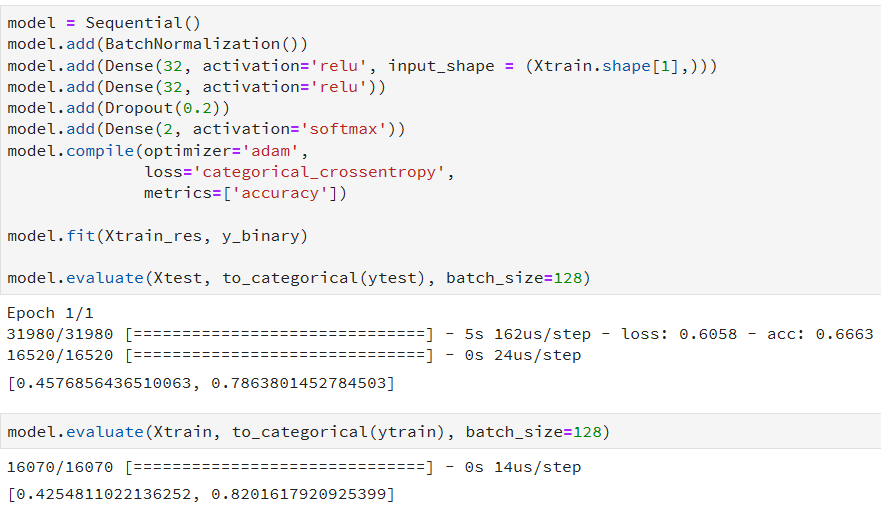

# Notebook

## Wrangling 

Operation3 is categorical --> `pd.get_dummies()`

## Handle missing_value:

Take1:

- Dropping all missing value: from 118 883 to 34 678 obs. 

Take2:

- Impute using mean

Take3:

- Impute using mean of unit

## Splitting Train - Test - Validation:

Take1:

- Val: 2018
- Test: 2016, 2017
- Train:  rest

## Handle Imbalanced dataset

#### Downsizing:

 From 34 678 to (633 x 2) obs

Pros:

- Quick 

Cons:

- Lose lots of information/ obs
- Unrealistic assumption about the world (balanced datasest while validation may not be balance)

#### Upsampling:

Copy and paste the ones with label 1 

Pros:

- Quick

Cons:

- Unrealistic assumption - messing with labels distribution

### Ensemble:

Get 633 label 1 with different 633 label 0 and fit several models. 

Pros:

- Retain more information
- taking into account of several obs of label 0

Cons:

- Time complexity
- still unrealistic assumption with balanced label distribution

#### Oversampling 

[SMOTE](https://jair.org/index.php/jair/article/view/10302)

Pros:

- Create synthetic samples

Cons:

- Unrealistic assumption

#### Costs sensitive learner

Apply weight to the label:

- By ratio between 1 vs 0
- FN vs FP

Pros:

- Let the model learns the imbalance of the dataset

Cons:

- More complicated

## Modelling

So with **complete case** to handle missing value, **smote** to oversample imbalanced dataset, basic models already produce good result but looking at the area under the Receiver Operator curve, LR is the most balanced model.

- Logistic Regression: more than 80% accuracy

  

- Random Forest: seems like over fitting, 99%

  

- K Nearest Neighbor: high specificity 

  

- Support Vector Machine: was included at first but taking forever to train so I excluded it.

**Feed Forward Neural Network**

Train accuracy: 82%, test accuracy is 78%

With 64 neurons, the test accuracy is 81.5% and train accuracy is 83.8%