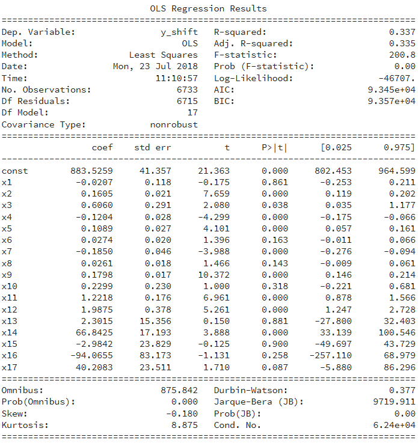

# Notebook - Lab Diary

## 1. Task 1

### a. Wrangling

Operation3 is categorical --> `pd.get_dummies()`


### b. Handle missing_value:

Take1:

- Dropping all missing value: from 118 883 to 34 678 obs. 


Take2:

- Impute using mean


Take3:

- Impute using mean of unit


### c. Splitting Train - Test - Validation:

Take1:

- Val: 2018
- Test: 2016, 2017
- Train:  rest


### d. Handle Imbalanced dataset

#### Downsizing:

 From 34 678 to (633 x 2) obs

Pros:

- Quick 

Cons:

- Lose lots of information/ obs
- Unrealistic assumption about the world (balanced datasest while validation may not be balance)

#### Upsampling:

Copy and paste the ones with label 1 

Pros:

- Quick

Cons:

- Unrealistic assumption - messing with labels distribution

#### Ensemble:

Get 633 label 1 with different 633 label 0 and fit several models. 

Pros:

- Retain more information
- taking into account of several obs of label 0

Cons:

- Time complexity
- still unrealistic assumption with balanced label distribution

#### Oversampling 

[SMOTE](https://jair.org/index.php/jair/article/view/10302)

Pros:

- Create synthetic samples

Cons:

- Unrealistic assumption

#### Costs sensitive learner

Apply weight to the label:

- By ratio between 1 vs 0
- FN vs FP

Pros:

- Let the model learns the imbalance of the dataset

Cons:

- More complicated


### e. Modelling

So with **complete case** to handle missing value, **smote** to oversample imbalanced dataset, basic models already produce good result but looking at the area under the Receiver Operator curve, LR is the most balanced model.

- Logistic Regression: more than 80% accuracy

  

- Random Forest: seems like over fitting, 99%

  

- K Nearest Neighbor: high specificity 

  

- Support Vector Machine: was included at first but taking forever to train so I excluded it.

So it seems like even the score is high, the ROC curve is saying a different story and Logistic Regression actually has the best prediction power among these models.

**Feed Forward Neural Network**

Train accuracy: 82%, test accuracy is 78%


With 64 neurons, the test accuracy is 81.5% and train accuracy is 83.8%

#### Setting up pipeline 

With **mean imputation** and **SMOTE upsampling**, the accuracy with the **Keras feed forward neural network** model is like below:

| No. epoch | Batch size | Result                                                       |
| --------- | ---------- | ------------------------------------------------------------ |
| 1         | 1          | Train accuracy: 60%, MSE for test: 0.27, Accuracy: 70%       |
| 5         | 5          | Train accuracy: 72%, MSE for test: 0.33, Test accuracy: 66%  |
| 10        | 5          | Train accuracy: 73%, MSE for test: 0.13, Test accuracy: 86%  |
| 20        | 5          | Train accuracy: 73.95%, MSE for test: 0.23, Test accuracy: 76% |

   Could possibly do cross-validation

Should do ROC for neural net but dont have time


### f. Feature Engineering

- Probably can exploit the time series character of this data to create new features


## 2. Task 2

Time range: around 351 days of 8421 obs.

Setting the time as index


### Splitting Train - Test - Validation

- Val: Last 10% of total days
- Test: next last 20% of total days
- Train: the rest of total days


### Handle missing value

Similar to task 1: try complete case first and impute in the pipeline?

Maybe plot and take a look to find if there is any seasonal trend. If yes, use it for imputation


### Categorical features

Level has 5 levels instead of 2 as in Task 1

Still can use the get_dummies() from Task 1


### Models

#### Ridge, Lasso and Elastic Net:

```
Fitting Ridge Regression model...
R squared score is: 0.522

Fitting Lasso model...
R squared score is: 0.522

Fitting Elastic Net model...
R squared score is: 0.521

Fitting Support Vector Regression model...
R squared score is: -0.024
```

#### Ordinary Least Squared



With test dataset:

The test R squared is 0.473 (still less than Ridge and Lasso).


#### Keras

After trying to do network configuration, I realize that since there are only 25 features, the number of neuron should not be more than that and decrease the number of neuron. The result immediately improve with only 10 epoch. This is probably because the neural learned noise from using too many neuron before. 

However, the result is still worse than base model of Ridge or Lasso Regression. So I won't continue with the Neural Network.

| No. epoch | Batch size | Result                    | No. of hidden layer | No. of neuron |
| --------- | ---------- | ------------------------- | ------------------- | ------------- |
| 1         | 1          | R squared for test: 0.326 | 1                   | 64            |
| 5         | 5          | R squared for test: 0.447 | 1                   | 64            |
| 7         | 5          | R squared for test: 0.493 | 1                   | 64            |
| 7         | 5          | R squared for test: 0.485 | 2                   | 64            |
| 20        | 5          | R squared for test: 0.379 | 2                   | 64            |
| 78        | 5          | R squared for test: 0.523 | 2                   | 64            |
| 10        | 5          | R squared for test: 0.489 | 2                   | 10            |

   

Failed to get Hyperopt to work, but seems like they donot have much example for regression problem. Will look into it later.

### Feature Engineer

- Diff?
- Correlation/ Auto-correlation
- 